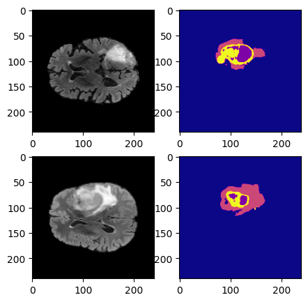

# Radiogenomic Classification of Glioblastoma by Multimodal 3D MRI

This project was done as part of B.Tech Capstone project CP302/CP303 at IIT Ropar (session 2022-23)

Authors: [Deepan Maitra](https://www.linkedin.com/in/deepan-maitra-71810b1b4/) (B.Tech CSE'23) and [Shivani Kumari](https://www.linkedin.com/in/shivani-kumari-577392193/) (B.Tech CSE'23)


The complete project report can be found [here](BTP_report__Deepan_Shivani_.pdf)


## A note about the directory structure:
- [data](data) contains the MRI scan files and the classification labels. Some pre-trained models are also saved in [saved_models](data/saved_models)
- [code](code) contains all the source code files, arranged in folders. The explanations of the code files are in [code_readme](code/README.md)
- [models](models) contains .py files returning all the segmentation, MTL and classification models. The explanations are in [models_readme](models/README.md)
- [Latex](latex_report_files) contains the Latex project report directory. [report.tex](latex_report_files/report.tex) is the main build file. Building the latex report is explained in [latex_readme](latex_report_files/README.md)
- [Results](results) contains all the implemented results (tabular and pictorial format) along with [code assistance](results/README.md)


## Project Abstract
O6-Methylguanine-DNA methyltransferase (MGMT) promoter methylation
status is an important genetic characteristic of glioblastoma and
is crucial for it’s diagnosis and chemotherapy efficacy. Multimodal
MRI imaging techniques can contribute towards monitored automation
of invasive surgical approaches. In this body of work, we propose
an end-to-end pipeline of tumour segmentation and subsequent radiogenomic
classification to classify the given MRI scans into being
methylated or non-methylated. We develop a novel Multitask-learning
based model (adapted from U-Net) to simultaneously perform segmentation
and classification. Further, we utilise the segmentation
results to cascade lightweight classification models based on several
MRI slice sampling techniques to output the final classification scores.
Our resultant pipeline performs well on each of the MRI axes, and several
ensembles are tried out to arrive at suitable improvements (using 5-fold-cross-validation).


## Motivation for the problem

MGMT is a DNA repair enzyme and the methylation status of its
promoter in newly diagnosed GBM tumour has been identified as a predictor
of chemotherapy response. The survival benefit governed
by the MGMT gene methylation status during temozolomide (TMZ) treatment
was observed and further work asserted that for patients
who received chemotherapy through temozolomide, the methylation status of
the MGMT promoter gene improved median survival compared with patients
who had unmethylated gliomas. Currently, surgical specimens based genetic lab testing is the standard to
assess the MGMT methylation status of GBM. In this method, a large tissue sample is required, which is tested by polymerase chain reaction (PCR) to judge
the methylation status. The major limitations of this invasive
methodology are the possibility of incomplete biopsy samples due to tumour
spatial heterogeneity and the high cost involved. Therefore, there is a neccessity to find non-invasive methods based
on brain imaging. 

## Source
This project uses the [BraTS 2021 Kaggle contest](https://www.kaggle.com/c/rsna-miccai-brain-tumor-radiogenomic-classification/overview/description) as the problem statement and utilises the same datasets as provided to competitors. 3D MRI files were sourced from the auxillary contest hosted in [Synapse](https://www.synapse.org/#!Synapse:syn27046444/wiki/616571). 

## The BraTS Dataset structure

- [classification_train_labels.csv](classification_train_labels.csv) has the true train labels of all the data samples included

- The MRI scan directory:

  Each independent case has a dedicated folder identified by a five-digit number. Within each of these “case” folders, there are four scans, each of them corresponding to each of the structural multi-parametric MRI (mpMRI) scans, in NifTI format. The exact mpMRI scans included are:

    - Fluid Attenuated Inversion Recovery (FLAIR)
    - T1-weighted pre-contrast (T1)
    - T1-weighted post-contrast (T1cE)
    - T2-weighted (T2)

   Exact folder structure:
   
   ```
   Training/Validation/Testing
    │
    └─── BraTS2021_00000
    │   │
    │   └─── BraTS2021_00000_flair.nii
    │   └─── BraTS2021_00000_t1.nii
    │   └─── BraTS2021_00000_t1ce.nii
    │   └─── BraTS2021_00000_t2.nii
    │   └─── BraTS2021_00000_seg.nii
    │
    │
    └─── BraTS2021_00002
    │   │
    │   └─── BraTS2021_00002_flair.nii
    │   └─── BraTS2021_00002_t1.nii
    │   └─── BraTS2021_00002_t1ce.nii
    │   └─── BraTS2021_00002_t2.nii
    │   └─── BraTS2021_00002_seg.nii
    ```

    Here, **BraTS2021_00000_flair.nii** indicates the Flair modality,  **BraTS2021_00000_t1.nii** indicates the T1-weighted modality,  **BraTS2021_00000_t2.nii** indicates the T2-weighted modality,  **BraTS2021_00000_t1ce.nii** indicates the T1-contrast-enhanced modality, and **BraTS2021_00000_seg.nii** indicates the segmentation tumour mask.


## Computational resources, tools and packages

* The project was run parrallely in Google colab enabled GPU, the Kaggle notebook GPU and using the multicore HPC server GPUs provided by IIT Ropar (Using a CPU alternative will increase the training time and might disrupt the implementation)
* The entire project was run on Python 3.8 using standard ML, DL and Image processing toolkit libraries. A full list of packages can be found here.
* These packages have been remarkably useful: [*nibabel*](https://pypi.org/project/nibabel/) (for reading NIFTI files), [*pydicom*](https://pypi.org/project/pydicom/) (for dealing with Dicom files), [*segmentation-models-3D*](https://pypi.org/project/segmentation-models-3D/) (for Loss functions and segmentation metrics), [*focal_loss*](https://pypi.org/project/focal-loss/) (for direct usage of Focal loss function).
* Latex builds were performed using [Overleaf](https://www.overleaf.com/). 


## Solution workflow

<p align="center">
    
</p>

The source codes are explained [here](code/README.md). Our methodology can be summarized in the following paths:
- **Semantic segmentation of the glioblastoma**: We used two variations of [UNet](models/Unet.py) (binary mask and multi-label mask) to perform segmentation. The files can be found in [Unet_segmentation](code/Unet_segmentation).
- **Multi-task model**: The MTL model uses a joint classification and segmentation loss function to give a two-tuple output of both the tumour mask and the binary classification probabilty. The files can be found in [Unet_MTL](code/UNet_MTL). Two 2D sampling techniques were tested.
- **SVM using GLCM matrix**: GLCM and Run-length encoding matrices were used to extract feature representations from the MRI scans, which were trained using SVM. The files are in [SVM](code/GLCM_SVM). 
- **Volumetric Projections**: Volumetric projections were used to condense the spatial information of the 3D volume. Projections were taken along 3 axes (axial, coronal, saggital) and were of 3 types (Mean, Maximum and Standard Deviation). The source codes are in [volumetric_projections](code/volumetric_projections_classification).
- **2D cropped-mask cascaded model**: A cascaded sequential model with segmentation networks and classifiers trained separately was used to predict the tumour mask, crop and bound the region-of-interest and then use the segmented single slice for final classification. The code can be found in [2D_cascaded](code/2D_cropped_cascaded).
-  **3D cropped-volume cascaded model**: The 2D cascaded funtionality was extended to include a 3D tumour voxel (with adaptive slice selectivity to choose the best slices). The code can be found in [3D_cascaded](code/3D_cropped_cascaded).

## Concluding Remarks

The proposed end-to-end tumour segmentation pipeline can be used assistively
to aid medical practioners in detecting and assessing the methylation of glioblastoma,
in order to increase the chemotherapy benefits of TMZ. Since our model
is sufficiently lightweight, it can save time in processing a large quantity of MRI
scans. As limitations to the proposed approach, it should be noted that because
the dataset size was quite small, an experimental bias could have been incurred.
Further research could be done to build more nuanced models by combining the
MRI modalities and give more emphasis on predicting the methylation status
through a countinuos value (across all the gene markers) rather than limiting to
a simple binary classification.

